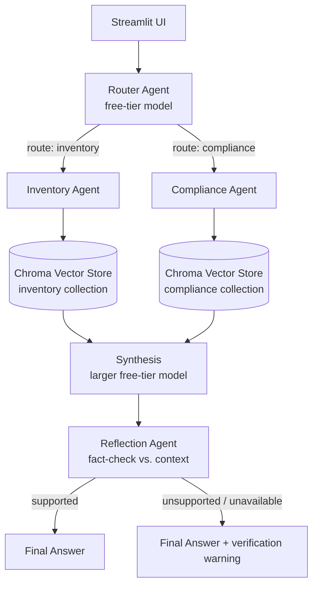
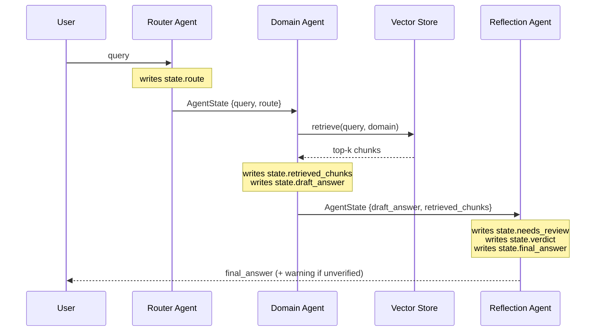

# SME Business-Ops Copilot

An agentic AI assistant for a Sri Lankan soap and cosmetics manufacturing SME. It answers staff questions about **inventory & production** and **HR & compliance** by retrieving grounded answers from the company's own policy and procedure documents — and flags any answer it cannot verify against those documents.

**Live demo:** https://intelligent-systems-agentic-ai-nekaavvaxmopyidfctj6ns.streamlit.app/
**Repository:** https://github.com/savindirathwella333-create/Intelligent-Systems-Agentic-AI

---

## 1. Project Description

Small manufacturing businesses accumulate operational knowledge across scattered internal documents — stock procedures, quality control steps, HR policies, statutory compliance rules. Staff answering routine questions ("when do we reorder?", "how is overtime calculated?") have to know which document to open and where to look inside it.

This project addresses that with a multi-agent Retrieval-Augmented Generation (RAG) system. A router agent classifies each incoming question by domain, a specialist agent retrieves from the matching document collection and drafts an answer, and a reflection agent verifies that draft against the retrieved source text before it reaches the user. Answers that cannot be fully verified are surfaced with a warning rather than presented as fact.

The system deliberately answers **only** from the supplied corpus. When a question falls outside what the documents cover, it declines rather than guessing — a design choice that matters more in a compliance context than raw answer coverage does.

---

## 2. Architecture



**Component summary**

| Layer | Implementation | File |
|---|---|---|
| UI | Streamlit text input + expandable source chunks | `app.py` |
| Orchestration | LangGraph `StateGraph` with conditional edges | `graph.py` |
| Routing | `classify()` — single-word domain classification | `graph.py` |
| Retrieval | `retrieve()` — Chroma similarity search per domain | `graph.py` |
| Synthesis | `synthesize()` — context-grounded answer generation | `graph.py` |
| Verification | `reflect()` — SUPPORTED/UNSUPPORTED verdict | `graph.py` |

---

## 3. Agentic Design Patterns

Three distinct patterns are implemented:

### 3.1 Router Pattern
`router_node` → `classify()` in `graph.py`

Every query is classified as `inventory` or `compliance` **before** any retrieval happens, using a small, fast model. This keeps the expensive retrieval-and-synthesis path scoped to one domain, and means the vector search never has to discriminate between unrelated document sets.

The classifier fails safe: if no model returns a usable verdict, it defaults to `compliance` rather than crashing or picking arbitrarily.

### 3.2 Tool-Use / RAG-Augmented Reasoning
`inventory_node` and `compliance_node` → `retrieve()` + `synthesize()` in `graph.py`

Domain agents do not answer from model memory. Each calls `retrieve()` — a Chroma vector-search tool — and passes the returned chunks to `synthesize()` as explicit context. The synthesis system prompt instructs the model to answer *only* from that context and to state explicitly when the context is insufficient.

### 3.3 Reflection / Self-Critique
`reflect_node` → `reflect()` in `graph.py`

After synthesis, a separate model call compares the draft answer against the retrieved chunks and returns `SUPPORTED` or `UNSUPPORTED`. Unsupported answers are still shown — but appended with a visible warning directing the user to confirm with the relevant department.

This pattern was verified working in testing (see §6.2), where it correctly flagged an answer that had extrapolated beyond the source text.

---

## 4. Agent-to-Agent Communication

Agents communicate by reading and writing fields on a shared, typed state object (`AgentState`, a `TypedDict`) passed between LangGraph nodes — not by exchanging free-form text. Each node has a defined read/write contract.

### 4.1 Message Flow



### 4.2 State Contract

| Field | Written by | Read by | Purpose |
|---|---|---|---|
| `query` | entry point | router, domain agents | The user's original question |
| `route` | router | conditional edge | Determines which domain agent runs |
| `retrieved_chunks` | domain agent | synthesis, reflection | Grounding context; also shown in the UI |
| `draft_answer` | domain agent | reflection | Pre-verification answer |
| `needs_review` | reflection | UI | Whether to attach a warning |
| `verdict` | reflection | diagnostics | `supported` / `unsupported` / `reflection_unavailable` |
| `final_answer` | reflection | UI | What the user actually sees |

The three-value `verdict` field is deliberate: `reflection_unavailable` distinguishes "the fact-checker judged this unsupported" from "the fact-checker could not run at all." Both set `needs_review: True`, but conflating them in diagnostics would hide infrastructure failures behind apparent content failures.

---

## 5. Model Selection Strategy

All models are accessed through **OpenRouter**, using its OpenAI-compatible API.

| Sub-task | Model tier | Why chosen |
|---|---|---|
| Intent routing (`classify`) | Small free-tier instruct models (Gemma 4 31B, GPT-OSS 20B, Gemma 4 26B) | Binary classification needs no deep reasoning. `max_tokens=20` and `temperature=0` keep it fast, cheap, and deterministic — the same query must always route the same way. |
| Answer synthesis (`synthesize`) | Larger free-tier model (Nemotron-3 Super 120B), with smaller models as fallback | Synthesis must read multiple retrieved chunks, reconcile them, and produce grounded prose. Higher latency is acceptable here because it runs once per query and determines answer quality. `max_tokens=400` gives room for a substantive answer. |
| Verification (`reflect`) | Small free-tier instruct models, widest fallback chain | Another binary judgment, so a small model suffices — but this step is the last line of defence against hallucination, so it has the longest fallback list to maximise the chance it runs at all. |

### 5.1 Why a Fallback Chain, Not a Single Model

Every model call in this project retries across an ordered list of models rather than calling one. This is a direct response to three distinct free-tier failure modes observed during development:

1. **Models retired without notice.** Two separate models returned `404 — This model is unavailable for free` mid-development, having been moved to paid-only tiers. Hardcoding a single model ID is fragile against this.
2. **Upstream rate limiting.** Free-tier capacity is shared globally. Models returned `429 — rate-limited upstream` during peak periods even with the account's own daily quota untouched.
3. **Unusable response shapes.** Reasoning-oriented models emitted their chain-of-thought first and were truncated by `max_tokens` before producing a verdict. GPT-OSS returned empty `content` on some calls. Both produce a *successful* HTTP response with no usable answer.

The chain handles all three uniformly: any exception, or any response that does not yield a parseable result, advances to the next model. Failure modes (2) and (3) are also mitigated by two attempts per model with a short backoff.

### 5.2 Parsing Robustness

Small models frequently ignore "respond with exactly one word." The classifier therefore uses substring matching (`"inventory" in raw`) rather than equality, and requires exactly one of the two labels to be present — an ambiguous response containing both is treated as a failure and falls through to the next model.

---

## 6. RAG Pipeline

### 6.1 Pipeline Design

| Stage | Choice | Rationale |
|---|---|---|
| **Corpus** | 18 domain documents across `documents/inventory/` (10) and `documents/compliance/` (8) | Written specifically for this business — stock, production, QC, safety, HR, payroll, statutory compliance. Not generic filler. |
| **Chunking** | Paragraph-based, ~500 char target (`chunk_text()`) | Policy documents are already structured by heading and paragraph. Merging whole paragraphs up to a size limit keeps a rule and its conditions together, rather than splitting mid-clause as fixed-width chunking would. |
| **Embeddings** | `all-MiniLM-L6-v2` (sentence-transformers) | Runs locally, no API key, no rate limit, no cost. Sufficient quality for a corpus of this size, and removes one external dependency from an already fragile free-tier stack. |
| **Vector store** | Chroma, two separate collections | Collections mirror the router's classification. Searching only the relevant domain reduces cross-domain false matches — an HR query cannot surface a warehouse chunk. |
| **Retrieval** | Top-3 per query (`k=3`) | Enough context for multi-part answers without diluting the prompt with marginally-relevant chunks. |

Encoding is pinned to UTF-8 on file read; the default Windows codepage corrupted em-dashes in retrieved chunks, which silently degraded the context passed to the model.

### 6.2 Retrieval Evaluation

Sample queries run against the deployed pipeline:

| # | Query | Routed to | Retrieval quality | Verdict |
|---|---|---|---|---|
| 1 | "How often should physical stock counts be done, and who performs them?" | inventory | Correct — pulled the counting schedule, the Stock Verifier separation-of-duties clause, and the responsibilities block | `supported` |
| 2 | "How is overtime pay calculated?" | compliance | Correct — retrieved the 1.5× rate clause plus the related payroll chunk. Model correctly derived the formula rather than just restating the rate | `supported` |
| 3 | "What happens to an employee's EPF when they resign?" | compliance | Correct chunks retrieved (exit procedure + responsibilities), **but** the generated answer added detail about withdrawal/transfer "as prescribed by the EPF Act" that is not in the source | `unsupported` — correctly flagged |
| 4 | "What criteria are used to approve a new supplier?" | inventory | Correct — supplier approval criteria retrieved | `supported` |
| 5 | "What's our current headcount and total payroll cost?" | — | No relevant chunks exist; system correctly declined rather than fabricating figures | declined |

**Query 3 is the most informative result.** Retrieval succeeded, synthesis over-extended, and the reflection agent caught it. This is precisely the failure mode reflection exists to catch, demonstrated end-to-end on real output rather than a contrived example.

---

## 7. Setup Instructions

### 7.1 Local

```bash
git clone https://github.com/savindirathwella333-create/Intelligent-Systems-Agentic-AI.git
cd Intelligent-Systems-Agentic-AI

python -m venv venv
source venv/Scripts/activate      # Windows (Git Bash)
source venv/bin/activate          # macOS / Linux

pip install -r requirements.txt
```

Create a `.env` file in the project root:

```
OPENROUTER_API_KEY=your-key-here
```

Run:

```bash
streamlit run app.py
```

The app opens at `http://localhost:8501`.

### 7.2 Deployment (Streamlit Community Cloud)

1. Push to GitHub.
2. At [share.streamlit.io](https://share.streamlit.io), create an app from the repository, branch `main`, main file `app.py`.
3. Under **Advanced settings → Secrets**, add:
   ```
   OPENROUTER_API_KEY = "your-key-here"
   ```
4. Deploy. Subsequent pushes to `main` redeploy automatically.

Two deployment-specific details are handled in code:

- **`pysqlite3` shim** — Streamlit Cloud's Linux image ships an `sqlite3` older than Chroma requires. `graph.py` swaps in `pysqlite3` at import time, before Chroma loads, inside a `try/except` so local Windows runs are unaffected.
- **Platform-conditional requirement** — `pysqlite3-binary` has no Windows wheel, and an unconditional entry causes `pip install -r requirements.txt` to abort entirely on Windows. It is therefore marked `; sys_platform != "win32"`.

### 7.3 Secrets Management

API keys are read from environment variables — via `python-dotenv` locally, via Streamlit's Secrets manager in deployment. `.env` is listed in `.gitignore` and has never been committed. No key appears in the source or in commit history.

---

## 8. Known Limitations

- **Free-tier dependency.** All inference runs on OpenRouter free-tier models, which are subject to a 50 requests/day account cap, shared upstream capacity, and unannounced model retirement. The fallback chain mitigates this but cannot eliminate it — under simultaneous congestion across all listed models, the app returns a graceful failure message rather than an answer.
- **Reflection is itself model-dependent.** When every reflection model is unavailable, verification cannot run and the answer is conservatively marked unverified. Diagnostically this is distinguishable (`reflection_unavailable`), but to the end user it is indistinguishable from a genuine content failure.
- **In-memory vector store.** Chroma is instantiated in-memory and rebuilt from source documents at every app start. Corpus changes require a restart, and there is no persistence between sessions. Acceptable at 18 documents; would not scale.
- **No conversational memory.** Each query is independent. Follow-up questions ("what about for slow-moving items?") have no access to prior turns.
- **English only.** All prompts and documents are English; Sinhala or Tamil queries are untested and unsupported.
- **Corpus is representative, not production.** Documents describe a realistic SME's procedures but are not a live company's actual records. Retrieval quality would need re-evaluation against real operational documents at production scale.
- **No automated test suite.** Retrieval and routing were evaluated manually (§6.2); there are no regression tests guarding against corpus or prompt changes degrading behaviour.

---

## 9. Technology Stack

| Purpose | Technology |
|---|---|
| Agent orchestration | LangGraph |
| LLM access | OpenRouter (OpenAI-compatible API) |
| Embeddings | sentence-transformers (`all-MiniLM-L6-v2`) |
| Vector store | Chroma |
| UI | Streamlit |
| Deployment | Streamlit Community Cloud |
| Config / secrets | python-dotenv, Streamlit Secrets |
